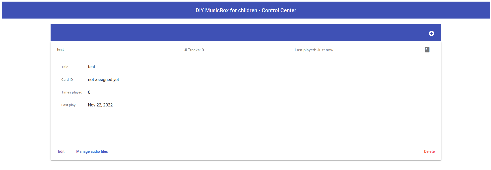
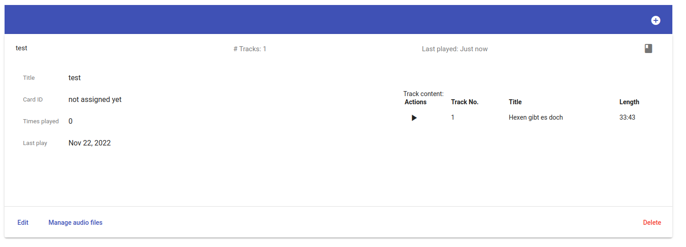

image::https://img.shields.io/badge/License-GPL%20v3-yellow.svg[GPLv3 License]

== Project Title

This is a small application which turns any Raspberry Pi in a music box.

My target was to build a DIY Music Box for small children. (Like the Toniebox)

== Features

- Microservice architecture
- Communicates via MQTT (mosquitto)
- Simple UI for managing audiobooks
- Audio upload / preview in UI
- Simple new Rfid card discovery / management
- Works on a Raspberry Pi Nano
- Has "easy to setup" install script (Ansible and Taskfile)

== Screenshots

== Installation

=== Preparation

You need:

* Taskfile on local / dev machine -> https://taskfile.dev/
* Ansible -> https://docs.ansible.com/ansible/latest/installation_guide/intro_installation.html#installing-and-upgrading-ansible
* NodeJS >= 10.23 to build the UI -> https://nodejs.org/en/download/
* If you use a HifiBerry DAC zero, see here: https://www.hifiberry.com/docs/software/configuring-linux-3-18-x/ (If not, you will need to enable either the headphone jack or hdmi for audio output - I guess hdmi is default)

You need to create a `.env` file in the root dir. (Copy `.env.dist` and adjust settings)
The assumption is, that the default Raspbian user (Pi) is used.

The content of that .env file:

[source,bash]
----
REMOTE_SERVER=<ip_address_of_pi>
RASPBERRY_PASSWORD=<password_of_pi_user>
----

=== Before you start

I tested this on a Raspberry Pi Zero and the audio preview in the browser.

NOTE: You cannot compile the UI on a Raspberry Pi Zero due to lack of memory (512 MB) But everything will be done by the tasks... :)

=== Installation

==== The Taskfile

The Taskfile has everything you need to make it run on the Pi. Here are the tasks to accomplish this (or parts of it, when required):

|===
|Task name            |Description
|setupTarget          | If the Raspberry was freshly set up, use this to prepare the Pi for all compile tasks (install golang and some dev-dependencies)
|compileRfidReader    | Copy the rfid-reader folder to the raspi, compile it and copy the compiled artifact to the Pi's home folder
|compileController    | Copy the controller folder to the raspi, compile it and copy the compiled artifact to the Pi's home folder
|compileIoController  | Copy the io-controller folder to the raspi, compile it and copy the compiled artifact to the Pi's home folder
|compileAudioPlayer   | Copy the audio-player folder to the raspi, compile it and copy the compiled artifact to the Pi's home folder
|compileAll           | Execute the tasks "compileRfidReader", "compileController", "compileIoController", "compileAudioPlayer", "compileUi" and "copyUi" at once
|compileAllBackend    | Execute the tasks "compileRfidReader", "compileController", "compileIoController" and "compileAudioPlayer" at once
|compileUi            | Build and package the UI and copy the result to the controller folder (into "ui" folder)
|copyUi               | Copy the ui from controller folder to the raspi into the Pi's home folder
|===

==== Order of operation

To get everything work as expected, you only need to execute two tasks in the given order:

* Call `setupTarget` once when you have a fresh Raspberry Pi set up (I assume you have the audio setup already done)
* Call `compileAll` to compile all binaries (it may take some time on the raspi zero...)

Example:

[source,bash]
----
task setupTarget
task compileAll
----

==== Cron jobs on Raspi

The `setupTarget` task will also add commands to the cron file of the pi user:

* to enable auto start of the components
* to add a liveness probe, which checks if every component is still alive (every 5th minute)

== Documentation

The UI is that simple, that I assume, I don't need to write any documentation for it.

If I'm wrong, let me know.

== License

https://choosealicense.com/licenses/gpl-3.0/[GPLv3]

== Authors

- https://www.gitlab.com/pmoscode[@pmoscode]

== Appendix: Possible optimizations

Everything will be compiled on the Raspi, because te local compile is not working for some reason. I get a "Segmentation Fault" for controller and audio-player. Rfid-reader is working fine. And io-controller didn't exist at that time.

The current state is located in the folder: `local-compile`
